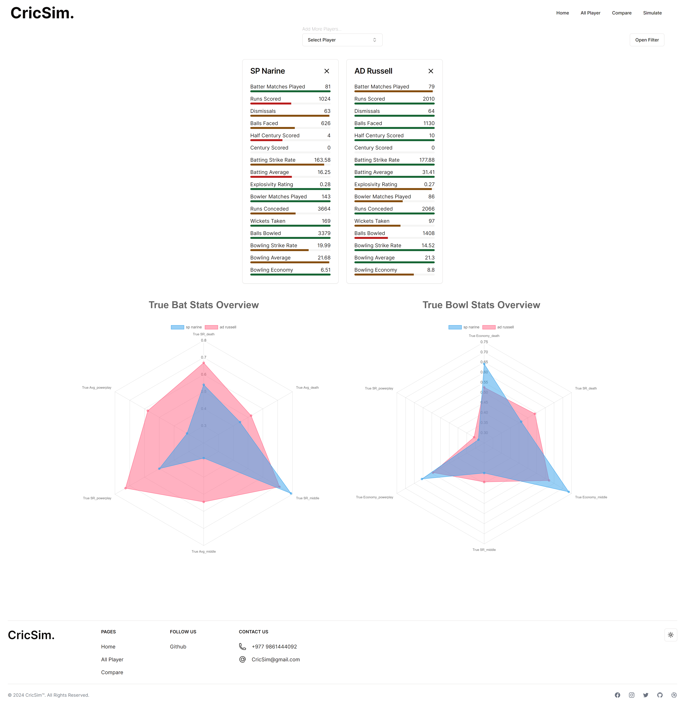
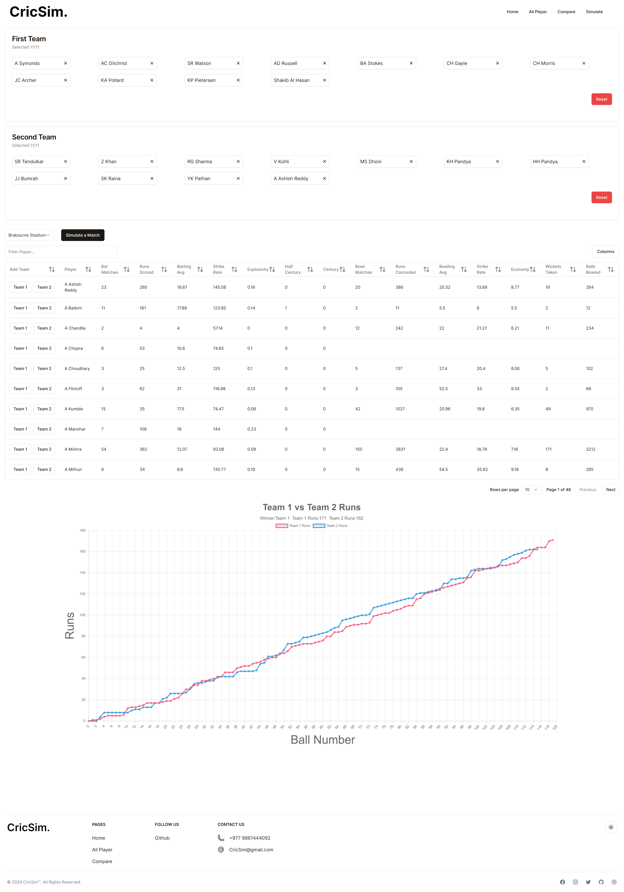
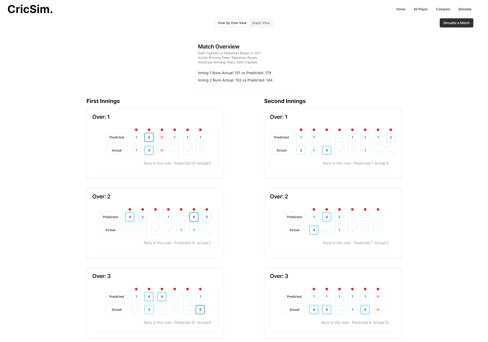
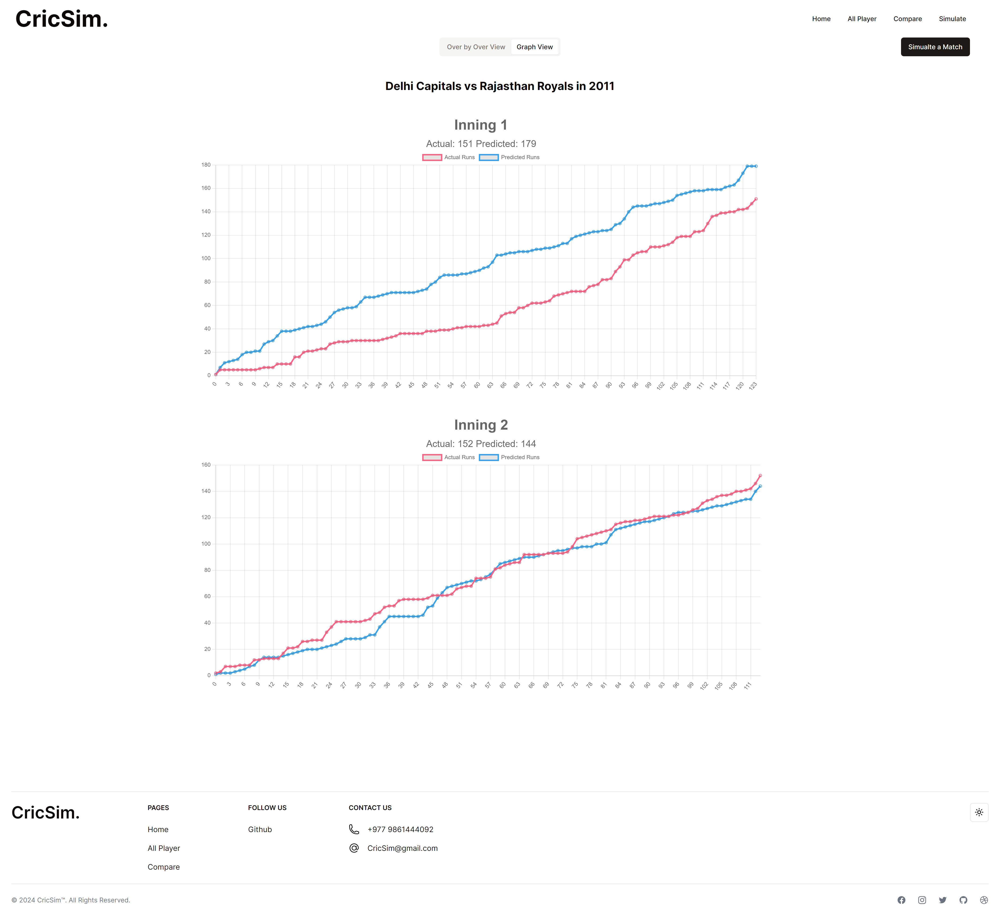

# CricSim

A cricket match analysis and simulation project, aiming to provide data analysis, visualization and simulation of matches. It uses the dataset of IPL matches from 2008-2022, uses two models, heuristic and LSTM, to develop the prediction for the matches.

This is the frontend for the project built using NextJs, tailwindCSS, ShadCn. The backend for the project is at [CricSim](https://github.com/nischalmainali21/Major-CricSim).

The [deployed version](https://cricsim.vercel.app/) only works for for comparing players and does not have simulation capabilites. For the full project, clone the backedn and this repo.

# Installation

```
    git clone https://github.com/nischalmainali21/Major-CricSim-Frontend.git
    cd Major-CricSim-Frontend
    npm install
    npm run dev
```

# Website Screenshots

## Home Page


## Compare Players



## Custom Team Selection



## LSTM Over by Over View



## LSTM Graph View


